## ProShift – Parcel Delivery Platform (Bangladesh)

ProShift is a full parcel delivery and rider-management platform that provides delivery service across all 64 districts of Bangladesh. Users can send parcels, track them, and make online payments. Riders manage deliveries and earnings. Admins control users, riders, parcels, payments, and cashout requests.

## 🚀 Live Demo  
**ProShift:** [(https://proshift-mover.web.app/)]

## 📌 Key Features (Frontend)

### Protected Route 
- if user not login user did not see protected page
- if user not login and try to see protected page Protected page redirect to user in login page

### JsonWeb Token
- jwt token system use for protected Api call
- secure api and safe user data for leak and hacker attack
- handle jwt token error and redirect to forbidden page 

### Parcel Sending System
- Users can log in and send parcels.
- Full detailed form (sender, receiver, weight, address).
- Online payment with **Stripe** (testing card).

### Bangladesh 64 District Coverage
- Integrated map using **Leaflet**.
- Shows all 64 service centers.
- Search district to find nearest service point.

### Parcel Tracking System
- Track parcel status using unique **Tracking ID**.

### Register/Login Authentication with Firebase
- Login/register securely in firebase
- Social login/ goggle
- logout system 

###  Be a Rider Application
- Anyone can apply to become a rider.
- Admin can approve or reject.

## Dashboard Overview (Role-Based)

There are **three roles**: User  |  Rider  |  Admin  
Each role has its own dashboard and permissions.

##  User Dashboard
Users can:
- View all parcel details.
- See total cost.
- View delivery status.
- Track parcel with tracking ID.

##  Rider Dashboard
Riders can:
- View total deliveries.
- View total earnings, today's earnings.
- View last week's earnings data in LineChar 
- View pending deliveries.
- View completed deliveries.
- Update delivery status.
- Request to admin earning money cashout .

##  Admin Dashboard
Admins can:
- Manage all users, riders, and parcels.
- Approve/reject rider applications.
- Assign parcels to riders.
- Approve cashout requests.
- Make admin or remove admin anyone.
- Full analytics for the platform.
- View parcel status in pie chart.

##  Tech Stack

### Frontend
- React 19  
- React Router 7  
- Tailwind CSS  
- DaisyUI  
- React TanStack Query
- Stripe Payment  
- Firebase Auth (for authentication)

**Npm Packages Used:**
- Axios  
- date-fns 
- React-leaflet (for map)
- lottie-react (for animation image)  
- framer-motion 
- gsap(for simple animation) 
- react-fast-marquee
- react-hot-toast
- Swiper (for carousel)
- react-icons
- sweetalert2
- UUID  (for Tracking id and Transaction id)
- recharts
- react-hook-form

### Backend

- vercel (for deploy)
- Node.js  
- Express.js  
- MongoDB  ( database )
- Firebase Admin  
- Stripe  (payment system)
- CORS  
- Dotenv  

### **Tools & Deployment**
- Firebase Hosting (client)
- Vercel (server)
- GitHub for version control

## 🛠 How to Run Locally

### Client
- npm install
- npm run dev

## Project Summary

ProShift is a complete parcel delivery ecosystem for Bangladesh with role-based dashboards, online payments, rider workflows, admin controls, district coverage, and parcel tracking.
Built using React, Tailwind, Stripe, Firebase, Leaflet, node, Express, MongoDB, and modern tools.

## 🙌 Author
**Mustafa Tazwer Shakil**
Junior MERN Stack Developer
email: tazwershakilshakil@gmail.com

## 📸 Screenshots

### Home Page
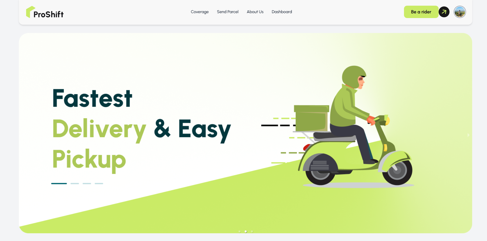

### Dashboard (User)
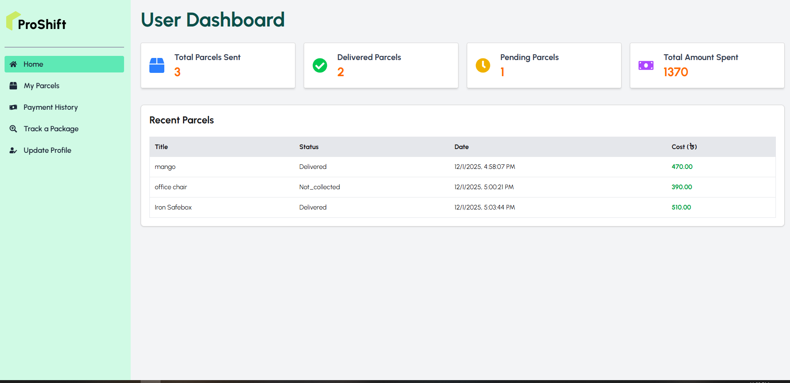

### Dashboard (Rider)
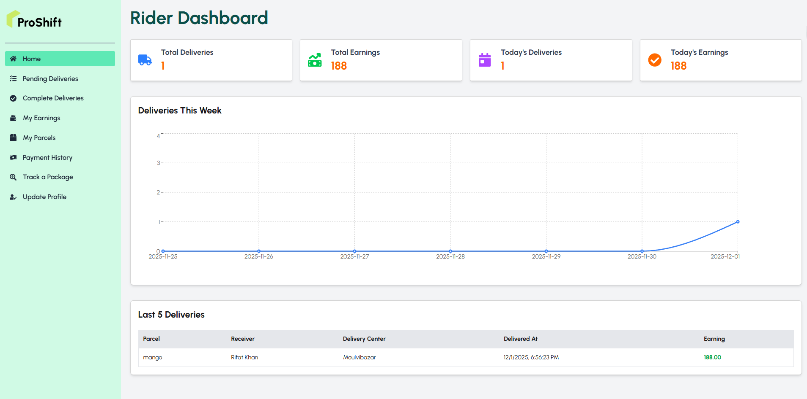

### Dashboard (Admin)
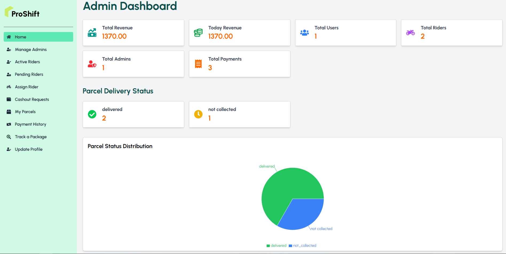

### Send Parcel Page
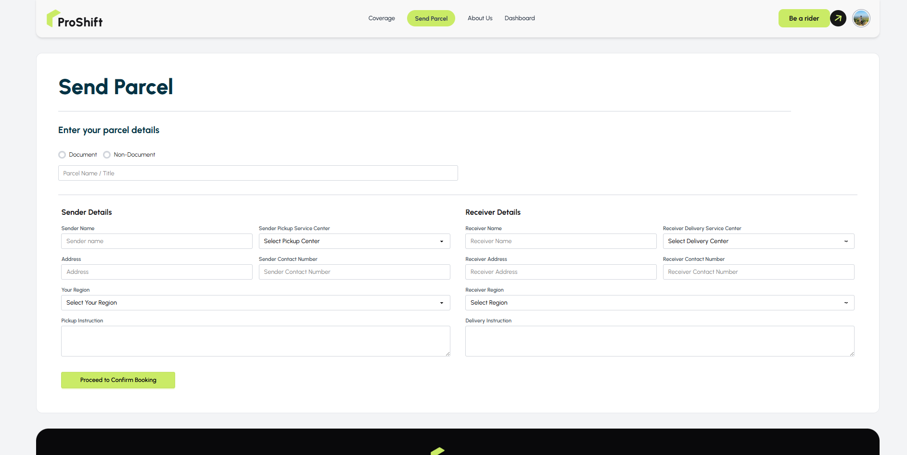

### Tracking Page
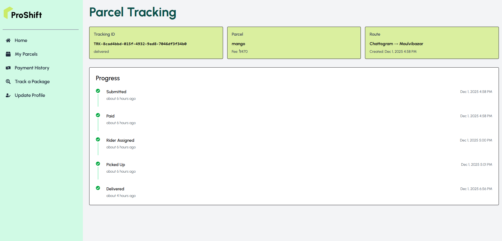

### Rider Application (Be a Rider)
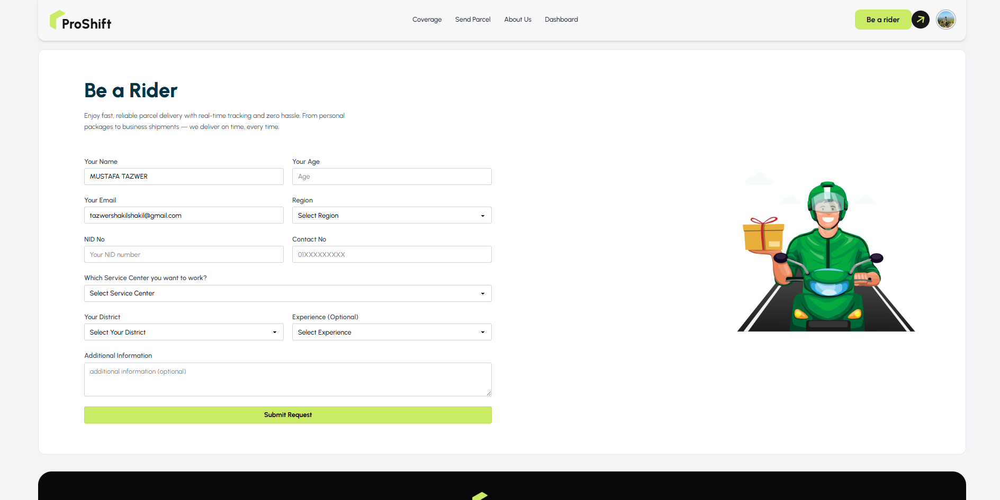

### Service coverage Map Page
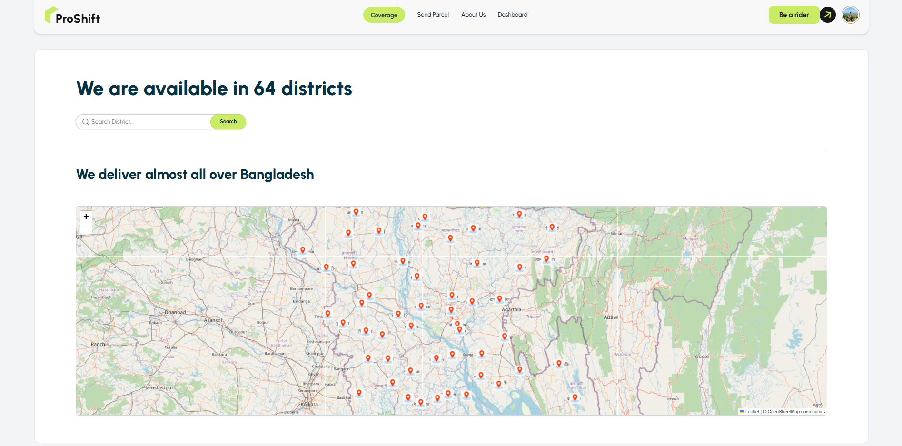

### About Page
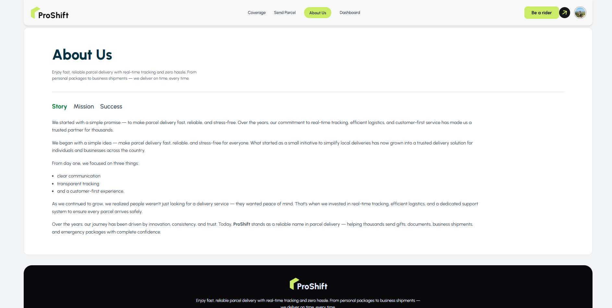

### Login page

### Register page
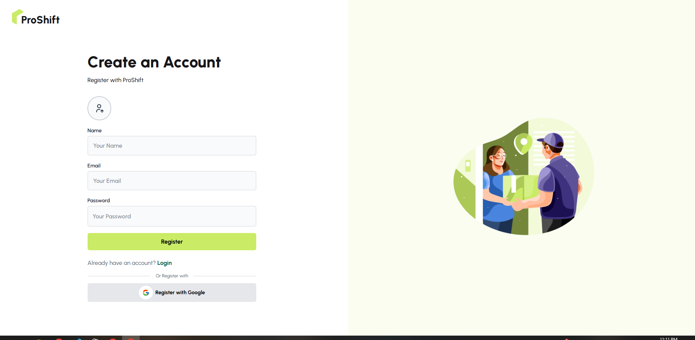

### 404 Error Page
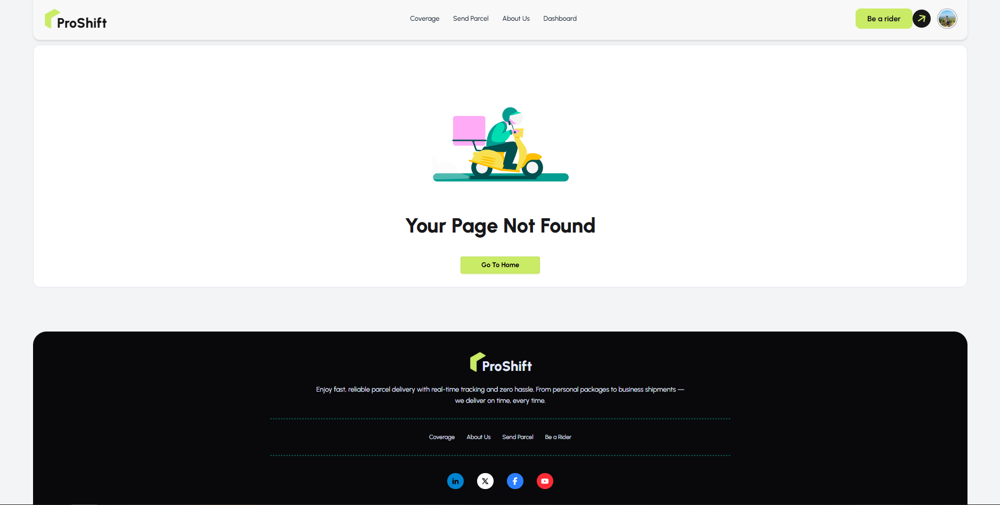

### ProShift Full Page
